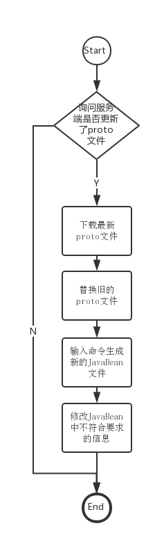
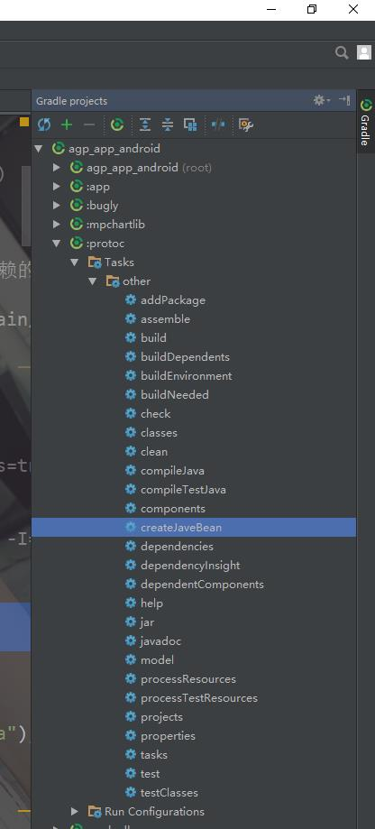
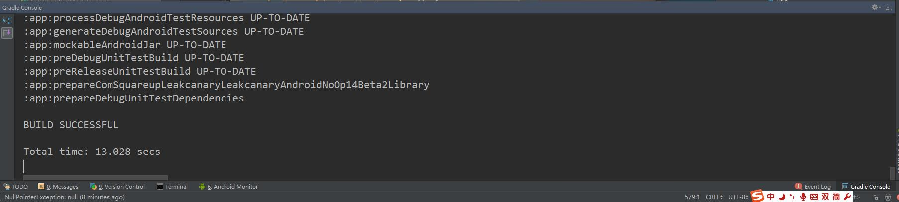

#

Gradle自动化构建ProtocolBuffer


最近在看[《Gradle For Android》](https://item.jd.com/11995759.html)一书,里面提到了讲解了一些Gradle的基本概念,
以及在Android Studio中应该如何使用Gradle.一本非常适合对Gradle一知半解的同学,建议大家可以买来看看.

书中提供的关于Gradle自动化的一些知识,所谓Gradle自动化构建,是指很多需要我们手工操作的事情可以使用Gradle来自动化实现.

举一个简单的例子,导出一个带签名的APK包,通常的步骤是:
```
Build
Generate Signed APK...
选择签名文件
输入文件密码
输入key
输入key密码
选择下一步
选择需要签名的APK类型
点确定
等待输出后,去目录找到这个APK
假设文件名字不符合要求(例如没有显示的写出APK渠道,版本等等),需要重新命名
将APK包发布
```

每次导出一个签名的APK,都需要经过这些步骤,而且当需要签名十几个甚至上百个签名包时,这个任务就会变得非常繁琐.
当然Gradle早就已经考虑到了这种情况,只需要安装Android插件配置好,输入:gradle build简单的命令变可实现批量打包.

关于这部分的技术大家可以搜:Android 批量打包.更多Gradle的资料可看文末的链接

Android Studio内置许多自动化构建的任务,但是我们在开发的过程中往往会遇到一些特殊的任务,这个时候学习一个编写一个自动化的任务就非常有必要了.

本文通过讲解自定义Protocol Buffer自动化构建任务来帮助大家理解.

下面是关于Protocol Buffer的一些基础知识,倘若已经对Protocol Buffer有一定了解的同学可以直接跳过.

##


基本介绍

Protocol Buffer是Google定义的一种在网络间传输的数据格式.

使用ProtoBuffer有很多好处,具体到以下几点:
###


采用二进制流方式传输,处理,传输,解析的效率,更省流量

我们都知道自然语言的信息最丰富的,人类最容易懂,机器最难懂,二进制机器最易懂,人类最难懂.<br>
即人类对语言的理解程度可以概括性的解释为:<br>
<b>自然语言→XML→JSON→二进制</b><br>
计算机正好与人类相反,为什么我们用Json替换xml,因为Json比xml效率更高,而且也能被人类所理解,虽然传输的信息描述没有那么丰富.
而为什么使用ProtoBuffer,因为它比Json更加简洁(采用二进制),同时对人类来说更加难懂,但是对机器来说效率却更高.<br>
<b>腾讯便是采用一种类ProtoBuffer的数据格式进行通讯的.</b>


###


统一定制数据类型效率更高.

这里所说的效率,并不是计算机上所说的执行速度和占用资源.以Json为例,我们经常会遇到这样的一个场景:<br>
服务端提供一个接口,返回固定的字段,类似于下面的表格

字段|含义
---|---
code|>0表示成功
message|描述code的成功或失败
data|响应数据,code>0返回
name|String类型,用户名
id|int类型,用户id

按照理想的状态,请求应该返回下面信息
```json
{"code":1,"message":"请求成功","data":{"name":"siyehua","id":10086}}
{"code":-1,"message":"密码不对","data":{}}
```
客户端根据json生成数据类型并解析.<br><br><br>


上面说的理想状态,很明显,理想是丰满的,现实是骨感的.<br>
服务器无数据的时候经常会出现返回下面这种情况:
```json
//明明说好是一个Json对象,关键时刻变成Json数组类型了
{"code":-1,"message":"密码不对","data":[]}

//说好这个message字段一定有,结果某次返回却没有了
//客户端如果没有做空判断可能直接异常闪退
{"code":1,"message":"请求成功","data":{"id":10086}}
```

客户端需要根据服务器返回的数据生成相应的JavaBean(Android),而IOS那边也需要生成自己的数据类型.<br>
随着业务的扩展增加或者修改了字段,客户端也需要修改.<br>可能原来说好一定有的字段,现在说不一定有了,又需要修改代码逻辑,做空判断等等...

<b>没有一个统一的规则对后期的维护修改是致命的,特别是在版本已经发布的情况下</b><br>
Protocol Buffer统一定制好一个proto文件,详细规定好字段信息,再使用proto生成工具生成对应语言的数据类型,例如java,c++.<br>
它和平台无关,定义一次能让整个项目的所有平台都使用同样意义的数据类型,无需担心各种意外情况,因为Protocol Buffer的语法
已经帮你定制好了,不符合proto定义文件的数据类型无法进行有效的传输.


关于更多Protocol Buffer请看[官方文档](https://developers.google.com/protocol-buffers/),需自备梯子,或文末的参考链接

##


自动化构建

Protocol Buffer的好处是巨大的,但是它同样带来一些不便,除了上文说到的不易被人类所阅读理解,
还有就是生成Java类文件过大(拥有两个属性的类高达上千行代码),以及不能直接修改Protocol Buffer生成的数据类型,如果需要
设置一些特殊效果,需要对类进行包装.
现在我在工作中根据Protocol Buffer生成一个JavaBean的步骤是:



我需要经常询问服务端是否更新了文件,服务端也要一次次回答我.如果有更新,每次都要做同样的操作把生成新的JavaBean,为什么不
把这一整套流程做成自动化的呢?

##

详细构建步骤

首先在module的build.gradle新建一个task任务.

每一个task都相当于一个main方法的入口,只要你添加了就会被假如到tasks列表依次执行.

```
task createJavaBean << {
    startCreate();
}
```

这就创建了一个任务,同步一下gradle,我们可以在右边的Gradle任务管理中查看到这个任务列表




创建即可运行这个任务,即执行了startCreate()方法开始自动化构建.<br>
也可以在Terminal命令行中输入gradlew 任务名 (mac下输入./gradlew 任务名)


实际上我们执行这任务的时候可能会输入一大堆无关这个任务的日志,类似于这样:



这些也是一个个任务,但是和我们建立的这个createJavaBean一点关系都没有,那为什么会执行呢?

实际上会这些任务并没有执行

Gradle的任务一共有三个阶段:<b>初始化,配置,执行</b>.
假设我们创建一个A任务

```groovy
task A {
    //do something...
}
```

那这个任务的//do something...会在Gralde的配置阶段便被执行,而 加了"<<"表示在执行的阶段才会执行它.<br>
所以我们创建的createJavaBean创建我们手动双击才会执行,假设我们希望它能在build阶段执行,只需要去掉"<<"即可.

接着,startCreate()只需要执行java/groovy代码即可,其实不需要懂groovy代码,使用纯粹的Java语言编写即可.
```groovy
void startCreate(){
    //判断文件是否更新(可更新Http请求判断文件是否更新,我这边是放在本地git仓库里,所以通过git命令更新)
    //没有更新则return
    //有更新则执行proto命令生成新的JavaBean
    //修改新的JavaBean的一些信息以适应当前项目
}
```

[详细代码](./build.gradle)


##


总结

这样,一个简单的自动构建任务就完成了.

新建一个自动化的任务真的非常简单,很多人使用Gradle还局限于对Android的各种配置中,
实际上Gradle的功能还不止如此,我强烈推荐大家参考文末的链接文章,来构建自己的Gradle任务.

#


Link

Name|Link
---|---
Gradle For Android图书|https://item.jd.com/11995759.html
Gradle官网|https://gradle.org/
Android Studio|https://developer.android.com/studio/build/index.html?hl=zh-cn
Android Gradle|http://tools.android.com/tech-docs/new-build-system/user-guide
Android Gradle中文译文|https://chaosleong.gitbooks.io/gradle-for-android/content/
Protocol Buffer|https://developers.google.com/protocol-buffers/
Windows上Protocol Buffer的接入|http://www.jianshu.com/p/47cd56f5e915
Protocol Buffer自动构建|http://www.jianshu.com/p/6c9f90538efe
Protocol Buffer For Android|http://www.jianshu.com/p/2a376e657ae0
Protocol Buffer For Android|http://www.jianshu.com/p/e8712962f0e9
Protocol Buffer nano使用| http://www.jianshu.com/p/185fc0e13028

##


License

```
Licensed under the Apache License, Version 2.0 (the "License");
you may not use this file except in compliance with the License.
You may obtain a copy of the License at

   http://www.apache.org/licenses/LICENSE-2.0

Unless required by applicable law or agreed to in writing, software
distributed under the License is distributed on an "AS IS" BASIS,
WITHOUT WARRANTIES OR CONDITIONS OF ANY KIND, either express or implied.
See the License for the specific language governing permissions and
limitations under the License.
```
